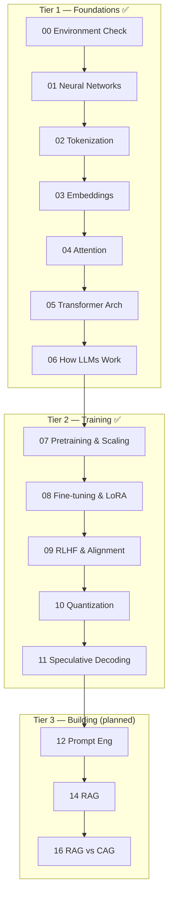

# AI Learning Notebooks

A self-paced, hands-on curriculum that takes you from *"I use AI tools"* to *"I understand and build AI systems."* Every notebook teaches one concept with a plain-English explanation, working code you can run, a visualization, and three exercises (with solutions).

The curriculum is organized into tiers that mirror a natural learning progression. Plus a bonus 7th tier: the original **RAG Design Patterns** notebooks.

```
Tier 1  Foundations          how AI/LLMs actually work          (00–06)
Tier 2  Training             how models are trained & aligned   (07–11)
Tier 3  Building with LLMs   RAG, caching, inference            (12–17)   [planned]
Tier 4  Agent Engineering    systems that use LLMs              (18–23)   [planned]
Tier 5  Evaluation & Prod    measuring & shipping AI            (24–27)   [planned]
Tier 6  Projects             capstones (train/RAG/agents)       (P1–P4)   [planned]
Tier 7  RAG Design Patterns  the original rag_learning series   (01–07)   ✅
```

---

## Curriculum map



---

## Status

| Tier | Notebooks | Status |
|------|-----------|--------|
| 1 — Foundations | `00_setup/`, `01_foundations/` (00–06) | ✅ Built & executed |
| 2 — Training | `02_training/` (07–11) | ✅ Built & executed |
| 3 — Building | `03_building/` (12–17) | ⬜ Planned |
| 4 — Agents | `04_agents/` (18–23) | ⬜ Planned |
| 5 — Evaluation | `05_evaluation/` (24–27) | ⬜ Planned |
| 6 — Projects | `06_projects/` (P1–P4) | ⬜ Planned |
| 7 — RAG Patterns | `07_rag_learning/` (00–07) | ✅ Pre-existing |

### Tier 1 — Foundations
| # | Notebook | Key concepts |
|---|----------|--------------|
| 00 | [Environment Check](00_setup/00_environment_check.ipynb) | device detection (cuda/mps/cpu), `.env`, package checks |
| 01 | [Neural Networks](01_foundations/01_neural_networks.ipynb) | forward/backprop from scratch in NumPy, gradient descent, autograd |
| 02 | [Tokenization](01_foundations/02_tokenization.ipynb) | BPE from scratch, GPT-2 tokenizer, tokens vs words |
| 03 | [Embeddings](01_foundations/03_embeddings.ipynb) | cosine similarity, meaning maps (PCA), semantic search |
| 04 | [Attention Mechanism](01_foundations/04_attention_mechanism.ipynb) | scaled dot-product attention, contextual "Apple" demo, multi-head |
| 05 | [Transformer Architecture](01_foundations/05_transformer_architecture.ipynb) | blocks, residuals, layer norm, positional encoding, TinyGPT |
| 06 | [How LLMs Work](01_foundations/06_how_llms_work.ipynb) | next-token prediction, temperature, top-k/p, hallucination |

### Tier 2 — Training
| # | Notebook | Key concepts |
|---|----------|--------------|
| 07 | [Pretraining & Scaling](02_training/07_pretraining_and_scaling.ipynb) | next-token pretraining, compression, scaling laws (measured) |
| 08 | [Fine-tuning & LoRA](02_training/08_fine_tuning_and_lora.ipynb) | LoRA from scratch, adapter swapping/merging, QLoRA |
| 09 | [RLHF & Alignment](02_training/09_rlhf_and_alignment.ipynb) | reward model (Bradley–Terry), PPO + KL leash, DPO |
| 10 | [Quantization](02_training/10_quantization.ipynb) | symmetric/per-channel int8/int4, error cliff, memory |
| 11 | [Speculative Decoding](02_training/11_speculative_decoding.ipynb) | draft→verify, accept/reject identity proof, speedup |

### Tier 7 — RAG Design Patterns (pre-existing)
See [07_rag_learning/](07_rag_learning/) — Naive RAG → Rerank → Multimodal → Graph → Hybrid → Agentic → Multi-Agent. These run with a Claude **or** fully-local (Ollama) backend on the "Helios Robotics" dataset. (Setup for Ollama/Neo4j is documented inside the first notebook.)

---

## Setup

This repo is managed with [`uv`](https://docs.astral.sh/uv/) (Python 3.13). Plain `pip` works too.

```bash
# Option A — uv (recommended)
uv sync

# Option B — pip
python -m venv .venv && source .venv/bin/activate
pip install -r requirements.txt

# Option C — conda
conda env create -f environment.yml && conda activate ai-learning
```

API keys (only needed from Tier 3 onward):

```bash
cp .env.example .env     # then fill in ANTHROPIC_API_KEY / OPENAI_API_KEY
```

**Tiers 1–2 run fully offline** — no API key required. A few notebooks download small open models (GPT-2, DistilBERT, MiniLM) on first run; they cache locally and fall back gracefully if you're offline.

Launch:

```bash
uv run jupyter lab      # or: jupyter lab
```

---

## Start here

- **"I use AI tools but don't understand them"** → start at notebook **01** (Neural Networks) and go in order.
- **"I understand the basics, I want to build"** → skim Tier 1, then start at **07** (Training) or jump to Tier 3 when it lands.
- **"I want to build production agent systems"** → do Tier 2, then head to Tier 4 (Agents) / Tier 7 (RAG patterns).

Every notebook lists its prerequisites in the header cell, so you always know what to read first.

---

## Notebook standard

Each notebook follows the same shape: **header** (tier, time, prerequisites, source) → **plain-English concept** → **minimal working example** → **visualization** → **3 exercises** (warm-up / apply / extend, with collapsed solutions) → **key takeaways + what's next**. See [.claude/CLAUDE.md](.claude/CLAUDE.md) for the full spec and content sources.
