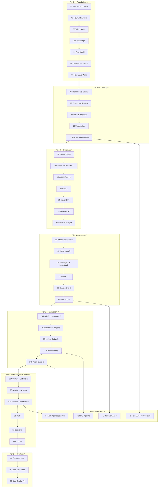

# AI Learning Notebooks

A self-paced, hands-on curriculum that takes you from *"I use AI tools"* to *"I understand and build AI systems"* — and past that, to *"I can ship, secure, and evaluate AI systems in production."* Every notebook teaches one concept with a plain-English explanation, working code you can run, a visualization, and three exercises (with solutions).

The curriculum is organized into tiers that mirror a natural learning progression, plus a bonus tier of the original **RAG Design Patterns** notebooks.

```
Tier 1  Foundations          how AI/LLMs actually work          (00–06)     ✅
Tier 2  Training             how models are trained & aligned   (07–11)    ✅
Tier 3  Building with LLMs   RAG, caching, inference             (12–17)   ✅
Tier 4  Agent Engineering    systems that use LLMs              (18–23)    ✅
Tier 5  Evaluation & Prod    measuring AI systems                (24–27b)  ✅
Tier 6  Projects             capstones (train/RAG/agents)        (P1–P4)   ✅
Tier 7  RAG Design Patterns  the original rag_learning series    (00–07)   ✅
Tier 8  Production & Safety  serving, security, cost, CI         (28–33)   ✅
Tier 9  Frontier             computer use, voice, data eng       (34–36)   ✅
```

---

## Priority legend

Every notebook below is labeled by how essential it is to becoming a complete AI Engineer. Use this to decide what to skip on a first pass, and when to come back.

- 🔴 **Crucial** — an AI Engineer without this skill will fail interviews or ship liabilities. Don't skip.
- 🟡 **Important** — expected of a strong AI Engineer; skippable on a first pass, with a specific trigger to return.
- 🟢 **Nice-to-have** — depth, breadth, or portfolio value; skip freely, revisit when the trigger appears.

---

## Curriculum map



---

## Notebook triage — every notebook, ranked

Use this table to decide a reading path. Full rationale for each label lives in the notebook's own header cell (new tiers) or below (pre-existing tiers 1–4 and 7, labeled here rather than re-edited in place).

### Tier 1 — Foundations
| # | Notebook | Priority | Why | Revisit if skipped |
|---|----------|:---:|-----|---------------------|
| 00 | [Environment Check](00_setup/00_environment_check.ipynb) | 🟡 | One-time setup; device detection, `.env`, package checks | If imports break later |
| 01 | [Neural Networks](01_foundations/01_neural_networks.ipynb) | 🟡 | Backprop/gradient descent underlie every training concept in Tier 2 | Before notebooks 07–09 if training math feels shaky |
| 02 | [Tokenization](01_foundations/02_tokenization.ipynb) | 🟡 | Token counts drive cost and context budgets everywhere downstream | Before notebook 13 or any cost work (32) |
| 03 | [Embeddings](01_foundations/03_embeddings.ipynb) | 🟡 | The basis for all of RAG (Tier 3, Tier 7, P2) | Before notebook 14/15 |
| 04 | [Attention Mechanism](01_foundations/04_attention_mechanism.ipynb) | 🔴 | The single mechanism every later architecture builds on | n/a — don't skip |
| 05 | [Transformer Architecture](01_foundations/05_transformer_architecture.ipynb) | 🔴 | Assembles attention into the model shape used everywhere, including P1 | n/a — don't skip |
| 06 | [How LLMs Work](01_foundations/06_how_llms_work.ipynb) | 🟡 | Temperature/sampling/hallucination recur in every generation notebook | Before notebook 12 if sampling behavior is confusing |

### Tier 2 — Training
| # | Notebook | Priority | Why | Revisit if skipped |
|---|----------|:---:|-----|---------------------|
| 07 | [Pretraining & Scaling](02_training/07_pretraining_and_scaling.ipynb) | 🟡 | Scaling-law reasoning resurfaces in notebook 25 and cost conversations | Before any "bigger model?" decision |
| 08 | [Fine-tuning & LoRA](02_training/08_fine_tuning_and_lora.ipynb) | 🟡 | LoRA/QLoRA are common practical skills | Before your first fine-tuning task |
| 09 | [RLHF & Alignment](02_training/09_rlhf_and_alignment.ipynb) | 🟢 | Valuable depth (DPO/PPO), usually a research-team concern day-to-day | Before an alignment-focused role/interview |
| 10 | [Quantization](02_training/10_quantization.ipynb) | 🟢 | Matters specifically for self-hosting/edge deployment | Before deploying on constrained hardware |
| 11 | [Speculative Decoding](02_training/11_speculative_decoding.ipynb) | 🟢 | Inference-optimization depth, usually owned by an infra team | Before an inference-serving role, or notebook 13b |

### Tier 3 — Building with LLMs
| # | Notebook | Priority | Why | Revisit if skipped |
|---|----------|:---:|-----|---------------------|
| 12 | [Prompt Engineering](03_building/12_prompt_engineering.ipynb) | 🔴 | The most-used daily skill in this entire curriculum | n/a |
| 13 | [Context Windows & KV Cache](03_building/13_context_windows_and_kv_cache.ipynb) | 🔴 | Context budgeting/caching costs affect every production feature (ties to 32) | n/a |
| 13b | [vLLM Inference Serving](03_building/13b_vllm_inference_serving.ipynb) | 🟡 | Self-hosting depth; skip if you only use hosted APIs | Before standing up a self-hosted inference server |
| 14 | [RAG Fundamentals](03_building/14_rag_fundamentals.ipynb) | 🔴 | One of the most common production LLM patterns | n/a |
| 15 | [Vector Databases](03_building/15_vector_databases.ipynb) | 🟡 | Needed once RAG scales past a toy corpus | Before your first production-scale RAG corpus |
| 16 | [RAG vs CAG](03_building/16_rag_vs_cag.ipynb) | 🟡 | Caching strategy matters at scale (ties to notebook 32) | Before a cost/latency pass on a RAG system |
| 17 | [Chain of Thought](03_building/17_chain_of_thought.ipynb) | 🟡 | A common prompting lever, before reaching for a reasoning model | When a task needs more reliable multi-step reasoning |

### Tier 4 — Agent Engineering
| # | Notebook | Priority | Why | Revisit if skipped |
|---|----------|:---:|-----|---------------------|
| 18 | [What Is an Agent](04_agents/18_what_is_an_agent.ipynb) | 🔴 | The conceptual foundation for the entire second half of the curriculum | n/a |
| 19 | [Agent Loop From Scratch](04_agents/19_agent_loop_from_scratch.ipynb) | 🔴 | Every later agent notebook assumes you understand this loop | n/a |
| 19b | [Agent Loop (Minimal)](04_agents/19b_agent_loop_minimal.ipynb) | 🟢 | A condensed reference version of 19 | When you need a copy-paste starting point |
| 20 | [Multi-Agent Patterns](04_agents/20_multi_agent_patterns.ipynb) | 🟡 | Needed once a single agent isn't enough (ties to P4) | Before building a multi-agent system |
| 21 | [Harness Engineering](04_agents/21_harness_engineering.ipynb) | 🔴 | "Same model, better harness = +36 points" — the highest-leverage idea here | n/a |
| 22 | [Context Engineering](04_agents/22_context_engineering.ipynb) | 🔴 | Write/Select/Compress/Isolate are daily agent-engineering vocabulary | n/a |
| 23 | [Loop Engineering](04_agents/23_loop_engineering.ipynb) | 🔴 | The shift from prompting to designing systems; underlies 27b and P4 | n/a |

### Tier 5 — Evaluation & Production (full detail in each header)
| # | Notebook | Priority | Why | Revisit if skipped |
|---|----------|:---:|-----|---------------------|
| 24 | [LLM Evals Fundamentals](05_evaluation/24_llm_evals_fundamentals.ipynb) | 🔴 | Gates nearly everything downstream (27b, 33, P2, P4) | n/a |
| 25 | [Benchmark Hygiene](05_evaluation/25_benchmark_hygiene.ipynb) | 🟡 | Contamination discipline, applied occasionally not daily | Before publishing a model comparison or synthetic data (36) |
| 26 | [LLM-as-Judge](05_evaluation/26_llm_as_judge.ipynb) | 🔴 | Judges silently ratify garbage if uncalibrated — pairs directly with 24 | n/a |
| 27 | [Production Monitoring](05_evaluation/27_production_monitoring.ipynb) | 🟡 | Observability tooling is learnable in days, often platform-team owned | The week before your first production deploy |
| 27b | [Agent Evals](05_evaluation/27b_agent_evals.ipynb) | 🔴 | The rarest, most differentiating skill on the market right now | n/a |

### Tier 6 — Projects
| # | Notebook | Priority | Why | Revisit if skipped |
|---|----------|:---:|-----|---------------------|
| P1 | [Train LLM From Scratch](06_projects/P1_train_llm_from_scratch.ipynb) | 🟢 | Deep-understanding/portfolio value; rarely done on the job | Before fundamentals-heavy interviews |
| P2 | [Build a RAG Pipeline](06_projects/P2_build_rag_pipeline.ipynb) | 🟡 | Consolidates Tier 3/7 RAG skills WITH evals — the production checklist | Before your first production RAG system |
| P3 | [Build a Research Agent](06_projects/P3_build_agent_from_scratch.ipynb) | 🟡 | First capstone synthesis of Tier 4 — worth doing before P4's larger system | Before attempting P4 |
| P4 | [Multi-Agent Research System](06_projects/P4_multi_agent_research_system.ipynb) | 🔴 | The proof-of-mastery artifact — everything before it prepares for this | n/a — the end goal |

### Tier 7 — RAG Design Patterns (pre-existing)
| # | Notebook | Priority | Why | Revisit if skipped |
|---|----------|:---:|-----|---------------------|
| 00 | [Setup & Foundations](07_rag_learning/00_setup_and_foundations.ipynb) | 🟡 | Needed once, to run the rest of the series | n/a |
| 01 | [Naive RAG](07_rag_learning/01_naive_rag.ipynb) | 🟡 | The baseline pattern notebook 14 builds on, as a from-scratch reference | Before comparing against the fancier patterns below |
| 02 | [Retrieve & Rerank](07_rag_learning/02_retrieve_and_rerank.ipynb) | 🟡 | A common, high-value production upgrade (used directly in P2's Exercise 3) | When naive RAG's retrieval quality plateaus |
| 03 | [Multimodal RAG](07_rag_learning/03_multimodal_rag.ipynb) | 🟢 | Valuable breadth for image+text corpora specifically | When a corpus includes images/diagrams |
| 04 | [Graph RAG](07_rag_learning/04_graph_rag.ipynb) | 🟢 | Valuable for highly-relational domains | When entities/relationships matter more than passage similarity |
| 05 | [Hybrid RAG](07_rag_learning/05_hybrid_rag.ipynb) | 🟢 | Combines keyword + vector search — good pattern breadth | When pure vector search misses exact-match queries (IDs, part numbers) |
| 06 | [Agentic RAG Router](07_rag_learning/06_agentic_rag_router.ipynb) | 🟢 | Routing-logic breadth | When a single retrieval strategy doesn't fit all query types |
| 07 | [Agent + RAG, Multi-Agent](07_rag_learning/07_agent_rag_multi_agent.ipynb) | 🟢 | Combines agents + RAG; a good bridge into Tier 4 | Before P4 |

### Tier 8 — Production & Safety (full detail in each header)
| # | Notebook | Priority | Why | Revisit if skipped |
|---|----------|:---:|-----|---------------------|
| 28 | [Structured Outputs](08_production/28_structured_outputs.ipynb) | 🔴 | Unreliable JSON is the #1 rookie production failure | n/a |
| 29 | [Serving LLM Apps](08_production/29_serving_llm_apps.ipynb) | 🟡 | The LLM-specific parts (streaming, fallback) are the new material | When you ship your first user-facing endpoint |
| 30 | [Security & Guardrails](08_production/30_security_and_guardrails.ipynb) | 🔴 | Agents + tools + untrusted content is *the* 2025–26 attack surface | n/a — before ANY agent touches real data/tools |
| 31 | [MCP](08_production/31_mcp.ipynb) | 🟡 | The de-facto tool-integration standard, conceptually small once you know 19 | The first time you share tools across agents/hosts |
| 32 | [Cost Engineering](08_production/32_cost_engineering.ipynb) | 🟡 | Cost is what gets AI features killed in production | The first invoice that makes someone wince |
| 33 | [CI for AI](08_production/33_ci_for_ai.ipynb) | 🟡 | Turns notebook-24 skills into team-level leverage | When a second person edits your prompts |

### Tier 9 — Frontier & the Data-Engineer Edge (full detail in each header)
| # | Notebook | Priority | Why | Revisit if skipped |
|---|----------|:---:|-----|---------------------|
| 34 | [Computer Use & Browser Agents](09_frontier/34_computer_use_and_browser_agents.ipynb) | 🟢 | Niche unless your product automates GUIs | When a task needs automating software with no API |
| 35 | [Voice & Realtime](09_frontier/35_voice_and_realtime.ipynb) | 🟢 | Valuable breadth, orthogonal to the core agent/eval stack | When a product needs voice in/out |
| 36 | [Data Engineering for AI](09_frontier/36_data_engineering_for_ai.ipynb) | 🟡 | The Data-Engineer × AI intersection — your unfair advantage | Before building any RAG corpus at scale |

---

## The 🔴-only fast path

Short on time? These notebooks alone take you from zero to a working understanding of production agent systems — everything else adds depth or breadth on top:

**04 → 05 → 12 → 13 → 14 → 18 → 19 → 21 → 22 → 23 → 24 → 26 → 27b → 28 → 30 → P4**

---

## Setup

This repo is managed with [`uv`](https://docs.astral.sh/uv/) (Python 3.13). Plain `pip` works too.

```bash
# Option A — uv (recommended)
uv sync

# Option B — pip
python -m venv .venv && source .venv/bin/activate
pip install -r requirements.txt

# Option C — conda
conda env create -f environment.yml && conda activate ai-learning
```

API keys (only needed from Tier 3 onward):

```bash
cp .env.example .env     # then fill in ANTHROPIC_API_KEY / OPENAI_API_KEY
```

**Tiers 1–2 run fully offline** — no API key required. A few notebooks download small open models (GPT-2, DistilBERT, MiniLM) on first run; they cache locally and fall back gracefully if you're offline. **Tiers 3–9 and the projects use `ANTHROPIC_API_KEY`** (and optionally `OPENAI_API_KEY` for notebook 35's audio calls, `LANGSMITH_API_KEY` for tracing in notebooks 21–23, 27, P3/P4) — but every live cell is guarded, so concept and code cells still run without a key. Live teaching calls default to a small, cheap model (`claude-haiku-4-5`); swap to `claude-opus-4-8` for production.

Launch:

```bash
uv run jupyter lab      # or: jupyter lab
```

---

## Start here

- **"I use AI tools but don't understand them"** → start at notebook **01** (Neural Networks) and go in order.
- **"I understand the basics, I want to build"** → skim Tier 1, then start at **12** (Prompt Engineering) and work through Tier 3.
- **"I want to build production agent systems"** → start at **18** (What Is an Agent), work through Tier 4, then build the **P3** capstone. Introduces Claude SDK agents, LangGraph, and LangSmith.
- **"I want to ship AI systems in production"** → start at **24** (LLM Evals Fundamentals), work through Tiers 5 and 8, then build the **P4** capstone. Covers evaluation, security, cost, CI, and the full production-hardening discipline most tutorials skip.

Every notebook lists its prerequisites AND a priority label in the header cell, so you always know what to read first and what's safe to defer.

---

## Notebook standard

Each notebook follows the same shape: **header** (tier, time, prerequisites, priority, source) → **plain-English concept** → **minimal working example** → **visualization** → **3 exercises** (warm-up / apply / extend, with collapsed solutions) → **key takeaways + what's next**. See [.claude/CLAUDE.md](.claude/CLAUDE.md) for the full spec and content sources.
